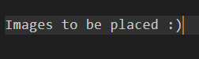

# Work I have done

## capstone

Lead artist and tech artist.

## Worhol

<body>

  

    
Summer game jam game worhol was done in a little under 48 hours for VGDC's self hosted summer game jam, and was my first attempt at creating a high visual quality game in unity.

    <a href="GamesIndex/Worhol.md">View more info here</a>
  

  

  
  

</body>

---

## GPU Based Particle Fire

A Tiny project made for a class using Compute shaders in order to generate large amounts of particles via gpu compute shaders and gpu side noise.

---

## Zom-Bam-Bros

A game for ics 161 game engine lab. Created almost all art for the game as well as help create architecture.

---

## Crackers and Cheese

Created screen space texture shaders, as well as help implement level design.

---

## Dino Stream

Global game jam 2018 game, Helped create architecture such as bullet pooling and api for adding new bullets, and created controller mappings. Created art assets

---

## Flight Fishing

Created all art for the game and a water distortion shader.

---

## Edge of Madness

Helped program traps as well as implement simple distortion shader.

---

## Instrumental

Created player aiming controls